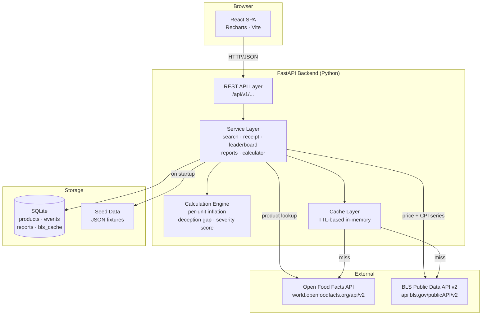
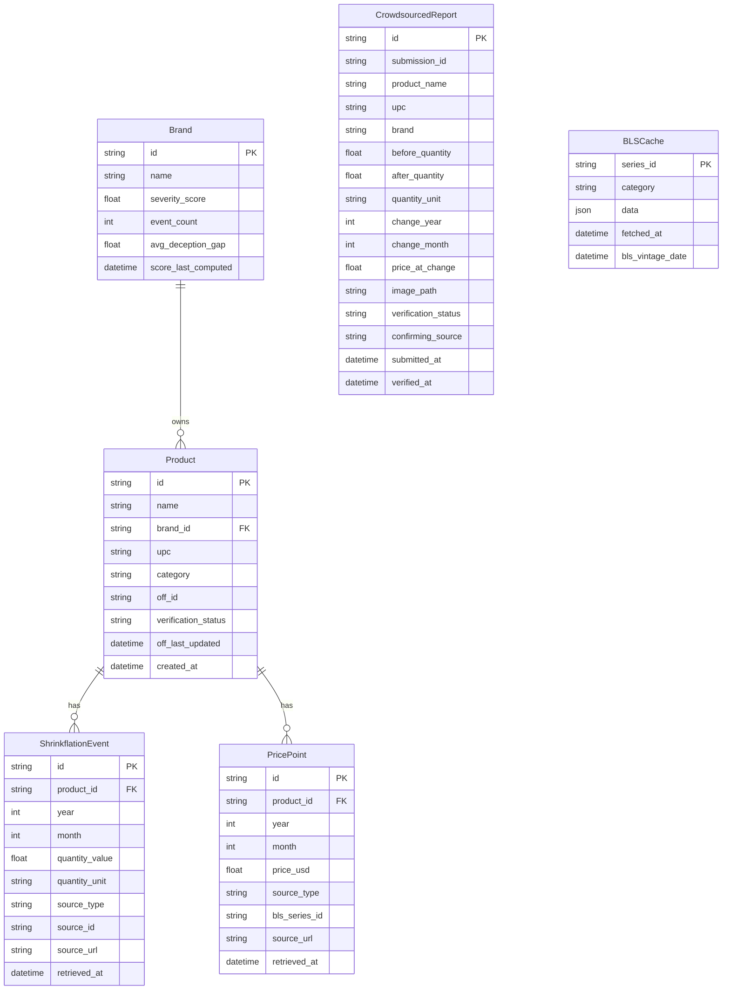

# Design Document — ShrinkFlation

## Overview

ShrinkFlation is a consumer-transparency web application that surfaces the hidden practice of shrinkflation — brands reducing product net weight or volume while holding or raising prices. The app gives users a visual "Shrinkflation Receipt" for any grocery product, a Brand Leaderboard ranked by severity, a crowdsourced reporting pipeline, and a weekly grocery list calculator that quantifies the personal financial impact.

The application is built for the Kiro Spark Challenge (Economics track — Transparency Guardrail). Every data claim must trace to a verifiable source; unverifiable claims are clearly labeled. The system is fully anonymous — no user accounts, no authentication, no personal data collection.

### Key Design Goals

- **Verifiability first**: every displayed value carries a source citation traceable to Open Food Facts, BLS, or the seed database.
- **Graceful degradation**: the app remains useful when external APIs are unavailable by falling back to the seed database.
- **Anonymity by design**: no session tokens, no cookies beyond ephemeral state, no PII collected or stored.
- **Hackathon scope**: SQLite is sufficient for the seed database and crowdsourced reports at this scale; no managed database infrastructure required.

---

## Architecture

The system follows a classic three-tier architecture: a React SPA frontend, a Python/FastAPI backend, and a SQLite database. External data is fetched from Open Food Facts and BLS at request time and cached in the database to reduce latency and API dependency.



### Architectural Decisions

**SQLite over PostgreSQL**: The seed database is 20–30 records; crowdsourced reports are append-only. SQLite eliminates infrastructure overhead for a hackathon deployment while remaining trivially replaceable.

**Server-side calculation**: Per-unit inflation and deception gap scores are computed in the FastAPI service layer, not the browser. This keeps the math auditable, testable, and consistent regardless of client.

**TTL cache for external APIs**: Open Food Facts and BLS responses are cached in-memory (and persisted to the `bls_cache` table for BLS data) to avoid repeated external calls and to provide fallback data when APIs are unavailable.

**No authentication**: The system is fully anonymous. Crowdsourced reports receive a server-generated UUID as a submission ID; no user identity is stored or required.

---

## Components and Interfaces

### Frontend Components

```
src/
├── components/
│   ├── SearchBar/          # name + UPC input, validation
│   ├── SearchResults/      # result list with verified/unverified badges
│   ├── ShrinkflationReceipt/
│   │   ├── QuantityTimeline.tsx   # step/line chart (Recharts)
│   │   ├── PriceTimeline.tsx      # line chart (Recharts)
│   │   ├── PerUnitChart.tsx       # overlaid per-unit line
│   │   ├── DeceptionGapBadge.tsx  # color-coded score
│   │   └── SourceCitation.tsx     # per-datapoint attribution
│   ├── BrandLeaderboard/   # ranked table with click-through
│   ├── ReportForm/         # crowdsourced submission form
│   ├── GroceryCalculator/  # list builder + export
│   └── DataSourcesPage/    # static sources reference page
├── hooks/
│   ├── useProductSearch.ts
│   ├── useReceipt.ts
│   ├── useLeaderboard.ts
│   └── useGroceryList.ts
└── api/
    └── client.ts           # typed fetch wrapper
```

### Backend Modules

```
app/
├── main.py                 # FastAPI app, CORS, startup
├── routers/
│   ├── search.py           # GET /api/v1/search
│   ├── products.py         # GET /api/v1/products/{id}
│   ├── receipt.py          # GET /api/v1/receipt/{product_id}
│   ├── leaderboard.py      # GET /api/v1/leaderboard
│   ├── reports.py          # POST /api/v1/reports
│   └── calculator.py       # POST /api/v1/calculator
├── services/
│   ├── search_service.py
│   ├── receipt_service.py
│   ├── leaderboard_service.py
│   ├── report_service.py
│   ├── calculator_service.py
│   ├── off_client.py       # Open Food Facts API wrapper
│   └── bls_client.py       # BLS API wrapper + cache
├── calculations/
│   ├── per_unit.py         # per-unit price computation
│   ├── deception_gap.py    # gap score computation
│   └── severity_score.py   # brand severity computation
├── models/
│   └── db.py               # SQLAlchemy ORM models
├── schemas/
│   └── api.py              # Pydantic request/response schemas
├── seed/
│   └── seed_data.json      # 20–30 verified shrinkflation examples
└── db/
    └── session.py          # SQLite engine + session factory
```

### REST API Endpoints

| Method | Path | Description |
|--------|------|-------------|
| `GET` | `/api/v1/search?q={name}` | Search products by name |
| `GET` | `/api/v1/search?upc={code}` | Search products by UPC |
| `GET` | `/api/v1/receipt/{product_id}` | Full Shrinkflation Receipt |
| `GET` | `/api/v1/leaderboard` | Brand Leaderboard |
| `GET` | `/api/v1/leaderboard/{brand_id}` | Brand detail with all events |
| `POST` | `/api/v1/reports` | Submit crowdsourced report |
| `POST` | `/api/v1/calculator` | Calculate grocery list hidden costs |
| `GET` | `/api/v1/sources` | Data sources reference page data |

---

## Data Models

### Database Schema (SQLite / SQLAlchemy)



### Key Pydantic Schemas

```python
# Search result item
class ProductSearchResult(BaseModel):
    id: str
    name: str
    brand: str
    current_quantity: float
    quantity_unit: str
    verification_status: Literal["verified", "unverified"]
    upc: str | None

# Full Shrinkflation Receipt
class ShrinkflationReceipt(BaseModel):
    product: ProductDetail
    quantity_timeline: list[QuantityDataPoint]
    price_timeline: list[PriceDataPoint]
    per_unit_timeline: list[PerUnitDataPoint]
    deception_gap: DeceptionGapResult | None
    cumulative_quantity_reduction_pct: float | None
    total_per_unit_inflation_pct: float | None
    data_last_updated: datetime
    sources: list[SourceCitation]

# Deception Gap result
class DeceptionGapResult(BaseModel):
    gap_pp: float                    # percentage points above CPI
    color: Literal["green", "yellow", "red"]
    per_unit_inflation_pct: float
    cpi_pct: float
    cpi_series_id: str
    cpi_date_range: tuple[int, int]  # (start_year, end_year)
    is_fallback_cpi: bool

# Crowdsourced report submission
class ReportSubmission(BaseModel):
    product_name: str
    upc: str | None
    brand: str
    before_quantity: float
    before_unit: str
    after_quantity: float
    after_unit: str
    change_year: int
    change_month: int
    price_at_change: float | None
    # image handled as multipart upload separately

# Grocery list calculator request
class GroceryListRequest(BaseModel):
    items: list[GroceryItem]

class GroceryItem(BaseModel):
    product_id: str
    weekly_quantity: int  # 1–52

# Calculator response per item
class GroceryItemResult(BaseModel):
    product_id: str
    product_name: str
    deception_gap: DeceptionGapResult | None
    baseline_per_unit_price: float | None   # 2019 baseline
    current_per_unit_price: float | None
    annual_hidden_cost: float | None
    has_data: bool
    sources: list[SourceCitation]
```

### Calculation Definitions

**Per-Unit Price** (for a given year):
```
per_unit_price(year) = retail_price(year) / net_quantity(year)
```

**Per-Unit Inflation** (earliest to most recent available data point):
```
per_unit_inflation_pct = ((per_unit_price_latest - per_unit_price_earliest) / per_unit_price_earliest) × 100
```

**Deception Gap**:
```
deception_gap_pp = per_unit_inflation_pct - cpi_pct_same_period
```
Color thresholds: green = 0–10 pp, yellow = 11–25 pp, red > 25 pp.

**Severity Score** (0–100, brand-level):
```
severity_score = normalize(
    Σ events × avg_quantity_reduction_pct × recency_weight
)
recency_weight = 2.0 if event_year >= (current_year - 3) else 1.0
```

**Annual Hidden Cost** (grocery calculator, 2019 baseline):
```
annual_hidden_cost = (current_per_unit_price - baseline_per_unit_price_2019)
                     × weekly_quantity × 52
```

### BLS Series Mapping

| Food Category | Average Price Series | CPI Series |
|---------------|---------------------|------------|
| Cereals & Bakery | APU0000702111 (bread) | CUUR0000SAF111 |
| Snacks / Chips | APU0000718311 | CUUR0000SAF1 |
| Beverages | APU0000712311 (OJ) | CUUR0000SAF116 |
| Dairy | APU0000710212 (milk) | CUUR0000SAF112 |
| Household Goods | — | CUUR0000SAH (fallback) |
| Fallback (all food) | — | CUUR0000SAF |

---

## Correctness Properties

*A property is a characteristic or behavior that should hold true across all valid executions of a system — essentially, a formal statement about what the system should do. Properties serve as the bridge between human-readable specifications and machine-verifiable correctness guarantees.*


### Property 1: Input validation rejects out-of-range queries

*For any* product name query string, the system SHALL accept it if and only if its length is between 1 and 200 characters (inclusive); strings of length 0 or > 200 must be rejected with a validation error.

**Validates: Requirements 1.1**

---

### Property 2: Search results contain all required display fields

*For any* product returned in a search result list, the rendered result object must contain a non-null product name, brand, current net quantity with unit, and a verification status of either "verified" or "unverified".

**Validates: Requirements 1.4**

---

### Property 3: UPC validation rejects invalid inputs

*For any* UPC input string that contains non-numeric characters or has fewer than 8 digits or more than 14 digits, the system SHALL reject it with an inline validation error and not submit the query.

**Validates: Requirements 2.1, 2.5**

---

### Property 4: UPC exact-match invariant

*For any* UPC that exists in the backing data (seed DB or OFF), the product returned by a UPC search must have a UPC field that exactly equals the submitted UPC string.

**Validates: Requirements 2.2**

---

### Property 5: Quantity timeline data completeness

*For any* product with N shrinkflation events (N ≥ 1), the quantity timeline must contain exactly N marked event data points, each with a non-null quantity value, year, and source citation.

**Validates: Requirements 3.1, 3.2, 3.3**

---

### Property 6: Cumulative quantity reduction formula

*For any* sequence of quantity data points ordered by year, the cumulative reduction percentage must equal `(first_quantity − last_quantity) / first_quantity × 100`.

**Validates: Requirements 3.4**

---

### Property 7: Price data source priority

*For any* product where BLS average price data exists for the relevant category, the price timeline data points must have `source_type == "bls"`. For any product where BLS data does not exist, the price timeline data points must have `source_type == "seed"`.

**Validates: Requirements 4.2**

---

### Property 8: Tooltip completeness for timeline data points

*For any* data point in either the quantity timeline or the price timeline, the tooltip payload must contain the numeric value (quantity or price), the year, and a source citation object with a non-empty source identifier (BLS series ID, OFF product URL, or seed entry ID).

**Validates: Requirements 3.3, 4.3**

---

### Property 9: Per-unit price formula correctness

*For any* year where both a retail price and a net quantity are available, the computed per-unit price must equal `retail_price / net_quantity` (within floating-point tolerance).

**Validates: Requirements 5.1**

---

### Property 10: Per-unit timeline excludes incomplete years

*For any* year in the data where either the retail price or the net quantity is missing, that year must be absent from the per-unit price timeline.

**Validates: Requirements 5.5**

---

### Property 11: Per-unit inflation percentage formula

*For any* per-unit price timeline with at least two data points, the total per-unit inflation percentage must equal `(last_per_unit − first_per_unit) / first_per_unit × 100`.

**Validates: Requirements 5.3**

---

### Property 12: Deception gap formula correctness

*For any* product where both per-unit inflation and CPI are calculable, the deception gap in percentage points must equal `per_unit_inflation_pct − cpi_pct_same_period`.

**Validates: Requirements 6.2**

---

### Property 13: Deception gap color threshold classification

*For any* numeric deception gap value `g`, the color label must be:
- `"green"` if `0 ≤ g ≤ 10`
- `"yellow"` if `11 ≤ g ≤ 25`
- `"red"` if `g > 25`

**Validates: Requirements 6.3**

---

### Property 14: Deception gap citation completeness

*For any* deception gap result, the response must include a non-null `cpi_series_id` and a `cpi_date_range` tuple of (start_year, end_year).

**Validates: Requirements 6.4**

---

### Property 15: Source citation format by source type

*For any* data point in a Shrinkflation Receipt:
- If `source_type == "open_food_facts"`, the citation URL must match the pattern `https://world.openfoodfacts.org/product/{off_id}`.
- If `source_type == "bls"`, the citation must include a non-empty `bls_series_id` and a URL containing `bls.gov`.
- If `source_type == "seed"`, the citation label must match the pattern `"Seed Database — {entry_id}"`.

**Validates: Requirements 7.1, 7.2, 7.3, 7.4**

---

### Property 16: Leaderboard descending sort invariant

*For any* leaderboard response with N brands, for every adjacent pair of brands at positions i and i+1, `brands[i].severity_score ≥ brands[i+1].severity_score`.

**Validates: Requirements 8.1**

---

### Property 17: Severity score formula correctness

*For any* brand's set of verified shrinkflation events, the severity score must be computed as the normalized sum of `avg_quantity_reduction_pct × recency_weight` per event, where `recency_weight = 2.0` for events within the last 3 years and `1.0` otherwise.

**Validates: Requirements 8.2**

---

### Property 18: Leaderboard entry required fields

*For any* brand entry in the leaderboard response, the entry must contain non-null values for brand name, number of affected products, average deception gap, and severity score.

**Validates: Requirements 8.3**

---

### Property 19: Brand detail contains only verified events for that brand

*For any* brand detail response, every shrinkflation event in the response must have `verification_status == "verified"` and `brand_id` equal to the requested brand's ID.

**Validates: Requirements 8.4**

---

### Property 20: Report submission validation rejects incomplete reports

*For any* crowdsourced report submission where at least one required field (product name, brand, before-quantity, after-quantity, or date) is null or empty, the API must return a validation error and must not persist the report to the database.

**Validates: Requirements 9.2**

---

### Property 21: Submission IDs are unique

*For any* two distinct valid crowdsourced report submissions, their assigned `submission_id` values must be different.

**Validates: Requirements 9.3**

---

### Property 22: New reports start as unverified

*For any* valid crowdsourced report submission, the initial `verification_status` in the stored record must be `"unverified"`.

**Validates: Requirements 9.4**

---

### Property 23: Auto-verification sets status and cites source

*For any* crowdsourced report whose submitted data matches the mocked OFF or BLS data (same product, same quantity change), after the auto-verification step the report's `verification_status` must be `"verified"` and `confirming_source` must be non-null.

**Validates: Requirements 9.5**

---

### Property 24: Image upload validation rejects invalid files

*For any* image file that exceeds 5 MB in size or has a MIME type other than `image/jpeg` or `image/png`, the upload must be rejected with an inline error and the form must not be submitted.

**Validates: Requirements 9.6**

---

### Property 25: Grocery list weekly quantity validation

*For any* grocery list item where `weekly_quantity < 1` or `weekly_quantity > 52`, the calculator must return a validation error for that item.

**Validates: Requirements 10.1**

---

### Property 26: Annual hidden cost formula correctness

*For any* grocery list item with available shrinkflation data, the computed `annual_hidden_cost` must equal `(current_per_unit_price − baseline_per_unit_price_2019) × weekly_quantity × 52`.

**Validates: Requirements 10.4**

---

### Property 27: Total grocery list cost is sum of item costs

*For any* grocery list with M items that have shrinkflation data, the `total_annual_hidden_cost` must equal the sum of `annual_hidden_cost` for all M items.

**Validates: Requirements 10.3**

---

### Property 28: CSV export contains source citations for all items

*For any* grocery list with N items that have shrinkflation data, the CSV export must contain N data rows, each with non-empty source citation columns.

**Validates: Requirements 10.6**

---

### Property 29: Seed database entry completeness

*For any* entry in the seed database, the entry must have non-null product name, UPC, brand, at least 2 quantity data points with dates, at least 1 price data point, and at least 1 source citation per data point.

**Validates: Requirements 11.2**

---

### Property 30: Receipt data freshness metadata

*For any* Shrinkflation Receipt response:
- `data_last_updated` must be a non-null datetime.
- If the product's `off_last_updated` is more than 180 days before the current date, the response must include a non-null `staleness_warning` string.
- For any price or CPI data point with `source_type == "bls"`, the data point must include a non-null `bls_vintage_date`.

**Validates: Requirements 12.1, 12.2, 12.3**

---

## Error Handling

### External API Failures

| Scenario | Behavior |
|----------|----------|
| Open Food Facts API unavailable | Serve results from seed DB only; display banner "Live product data temporarily unavailable — showing curated data only" |
| BLS API unavailable | Use cached BLS data from `bls_cache` table if available; if no cache, display "Price data temporarily unavailable" on affected charts |
| BLS category series unavailable | Fall back to overall Food CPI series `CUUR0000SAF`; label the fallback explicitly on the deception gap badge |
| OFF product not found by UPC | Return 404 with message "Product not found — contribute data"; pre-fill report form with submitted UPC |
| OFF product data stale (> 180 days) | Display staleness warning on receipt; do not block rendering |

### Input Validation Errors

All validation errors are returned as HTTP 422 with a structured JSON body:

```json
{
  "detail": [
    {
      "field": "weekly_quantity",
      "message": "Must be between 1 and 52",
      "value": 0
    }
  ]
}
```

Frontend displays inline error messages adjacent to the offending field; form submission is blocked until all errors are resolved.

### Calculation Gaps

| Scenario | Behavior |
|----------|----------|
| Missing price for a year | Exclude year from per-unit timeline; display note "Data gap: [year] excluded" |
| Missing quantity for a year | Same as above |
| Per-unit inflation not calculable | Display "Deception Gap: insufficient data" instead of score |
| No quantity history | Display "Quantity history unverified — contribute data" in place of chart |
| No price history | Display "Price history unavailable — contribute data" in place of chart |

### Image Upload Errors

- File > 5 MB: inline error "File too large — maximum 5 MB"
- Non-JPEG/PNG: inline error "Unsupported format — please upload a JPEG or PNG"
- Both errors are client-side validated before upload begins; server also validates as a second layer

### HTTP Error Responses

| Status | Scenario |
|--------|----------|
| 400 | Malformed request body |
| 404 | Product or brand not found |
| 422 | Validation error (field-level detail in body) |
| 503 | External API unavailable (with fallback notice in body) |

---

## Testing Strategy

### Overview

The testing strategy uses a dual approach: property-based tests for universal correctness properties and example-based unit/integration tests for specific scenarios, edge cases, and UI behavior.

**Property-based testing library**: [Hypothesis](https://hypothesis.readthedocs.io/) (Python) for backend calculation and validation logic.

### Property-Based Tests

Each correctness property from the Correctness Properties section is implemented as a single Hypothesis test. All property tests run a minimum of 100 iterations.

Tag format: `# Feature: shrinkflation, Property {N}: {property_text}`

| Property | Test Location | Hypothesis Strategy |
|----------|--------------|---------------------|
| P1: Input validation (name length) | `tests/test_validation.py` | `st.text()` with varying lengths |
| P2: Search result fields | `tests/test_search.py` | `st.builds(ProductSearchResult)` |
| P3: UPC validation | `tests/test_validation.py` | `st.text()` with non-numeric chars, short/long lengths |
| P4: UPC exact match | `tests/test_search.py` | `st.from_regex(r'\d{8,14}')` |
| P5: Quantity timeline completeness | `tests/test_receipt.py` | `st.lists(st.builds(ShrinkflationEvent), min_size=1)` |
| P6: Cumulative reduction formula | `tests/test_calculations.py` | `st.lists(st.floats(min_value=0.1), min_size=2)` |
| P7: Price source priority | `tests/test_receipt.py` | `st.booleans()` for BLS availability |
| P8: Tooltip completeness | `tests/test_receipt.py` | `st.builds(QuantityDataPoint \| PriceDataPoint)` |
| P9: Per-unit formula | `tests/test_calculations.py` | `st.floats(min_value=0.01)` for price and quantity |
| P10: Per-unit excludes incomplete years | `tests/test_calculations.py` | `st.lists(st.builds(YearlyData))` with optional fields |
| P11: Per-unit inflation formula | `tests/test_calculations.py` | `st.lists(st.floats(min_value=0.01), min_size=2)` |
| P12: Deception gap formula | `tests/test_calculations.py` | `st.floats()` for per-unit inflation and CPI |
| P13: Deception gap color thresholds | `tests/test_calculations.py` | `st.floats(min_value=0)` |
| P14: Deception gap citation fields | `tests/test_receipt.py` | `st.builds(DeceptionGapResult)` |
| P15: Source citation format by type | `tests/test_citations.py` | `st.sampled_from(["bls","off","seed"])` + data |
| P16: Leaderboard sort invariant | `tests/test_leaderboard.py` | `st.lists(st.builds(BrandEntry), min_size=2)` |
| P17: Severity score formula | `tests/test_calculations.py` | `st.lists(st.builds(ShrinkflationEvent), min_size=1)` |
| P18: Leaderboard entry fields | `tests/test_leaderboard.py` | `st.builds(BrandEntry)` |
| P19: Brand detail verified-only | `tests/test_leaderboard.py` | `st.lists(st.builds(ShrinkflationEvent))` |
| P20: Report validation rejects incomplete | `tests/test_reports.py` | `st.builds(ReportSubmission)` with nulled fields |
| P21: Submission ID uniqueness | `tests/test_reports.py` | `st.lists(st.builds(ReportSubmission), min_size=2)` |
| P22: New reports start unverified | `tests/test_reports.py` | `st.builds(ReportSubmission)` |
| P23: Auto-verification sets status | `tests/test_reports.py` | `st.builds(ReportSubmission)` with matching mock data |
| P24: Image upload validation | `tests/test_reports.py` | `st.binary()` with varying sizes and MIME types |
| P25: Grocery quantity validation | `tests/test_calculator.py` | `st.integers()` outside 1–52 range |
| P26: Annual hidden cost formula | `tests/test_calculator.py` | `st.floats(min_value=0.01)` for prices, `st.integers(1,52)` |
| P27: Total cost summation | `tests/test_calculator.py` | `st.lists(st.builds(GroceryItemResult), min_size=1)` |
| P28: CSV export citations | `tests/test_calculator.py` | `st.lists(st.builds(GroceryItemResult), min_size=1)` |
| P29: Seed entry completeness | `tests/test_seed.py` | Iterate over all seed entries |
| P30: Receipt freshness metadata | `tests/test_receipt.py` | `st.datetimes()` for off_last_updated |

### Example-Based Unit Tests

These cover specific scenarios, edge cases, and UI behaviors not suited to property testing:

- **Search**: empty results message and link (Req 1.3), OFF API unavailable fallback (Req 1.5), direct UPC navigation (Req 2.3), UPC not found pre-fill (Req 2.4)
- **Receipt**: no quantity history label (Req 3.5), seed DB price label (Req 4.4), no price history label (Req 4.5), per-unit formula display (Req 5.4), CPI fallback label (Req 6.5), insufficient data message (Req 6.6), unverified data label (Req 7.5)
- **Leaderboard**: last-updated timestamp and event count (Req 8.6)
- **Reports**: form field rendering (Req 9.1), no-data grocery item label (Req 10.5)
- **Data sources page**: all three sources present with required fields (Req 12.4)

### Integration Tests

- BLS cache: verify that a BLS series fetched once is served from cache on subsequent requests
- OFF fallback: verify that when OFF returns 503, the search endpoint returns seed-only results with the fallback notice
- Auto-verification pipeline: submit a report matching seed data; verify status transitions to "verified"
- Leaderboard refresh: verify that a newly verified report causes the affected brand's severity score to be recalculated
- Seed URL reachability: build-time script that HTTP-checks all source URLs in `seed_data.json`

### Smoke Tests

- Seed database coverage: at startup, assert `len(events) >= 20`, `len(distinct_brands) >= 10`, `len(distinct_categories) >= 5`
- BLS series mapping: at startup, assert all category-to-series mappings resolve to known BLS series IDs

### Frontend Testing

- **Vitest + React Testing Library** for component unit tests
- Snapshot tests for `DeceptionGapBadge` color rendering (green/yellow/red)
- Snapshot tests for `SourceCitation` format by source type
- Example-based tests for `SearchBar` validation (empty submit, 201-char input)
- Example-based tests for `ReportForm` field validation and image rejection
- Recharts chart data is tested at the data-preparation layer (pure functions), not at the DOM level

### Test Configuration

```
# Backend (pytest + Hypothesis)
pytest tests/ --hypothesis-seed=0
# Each @given test runs minimum 100 examples by default
# settings(max_examples=100) applied globally in conftest.py

# Frontend (Vitest)
vitest --run
```
